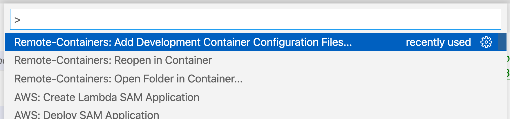
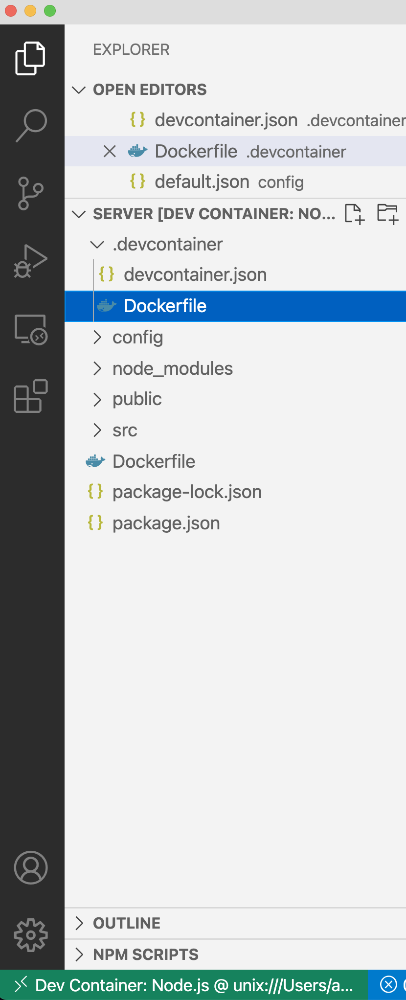

# Práctica 1. Dockerizar una aplicación

## EoloPlanner

Este proyecto es una aplicación distribuida formada por diferentes servicios que se comunican entre sí usando API REST y gRPC. La aplicación ofrece un interfaz web que se comunica con el servidor con GraphQL. 

Algunos servicios están implementados con Node.js/Express y otros con Java/Spring. Estas tecnologías deben estar instaladas en el host para poder construir y ejecutar los servicios. También se requiere Docker para ejecutar los servicios auxiliares (MySQL y MongoDB).

Para la construcción de los servicios y su ejecución, así como la ejecución de los servicios auxiliares requeridos se usan scripts implementados en Node.js. Posiblemente no sea el lenguaje de scripting más utilizado para este caso de uso, pero en este caso concreto facilita la interoperabilidad en varios SOs y es sencillo.

## Creación de las imagenes Docker

- Server: Multistage Dockerfile con cacheo de librerias node
- WeatherService: Se creará usando buildpacks (Pack)
- Planner: Multistage Dockerfile con cacheo de librerías
maven.
- TopoService: JIB

Se puede ejecutar [build_docker_images.sh](build_docker_images.sh) para crear todas las imagenes y subirlas a Docker Hub. Se necesitan los credenciales de DockerHub para que funcione.

## Docker-compose

Se han creado dos Docker-compose:

- [docker-compose-infra.yaml](docker-compose-infra.yaml) :  Para acceder a los servicios MySQL, Mongo y RabbitMQ, desde los .devcontainers de VSCODE

`docker-compose -f docker-compose-infra.yaml up`

- [docker-compose.yaml](docker-compose.yaml) :  Contiene todos los servicios de la aplicación EoloPlanner mas los servicios de infra (MYSQL, Mongo, RabbitMQ) y las configuraciones necesarias para usarlos y conectarse correctamente.

`docker-compose up`

Se han usado variables de entorno propias, configuración de Spring via variables de entorno y [node-config](https://github.com/node-config/node-config)

`NODE_ENV=production`

Los servicios esperan unos por otros usando varias técnicas:
- wait-for-it: https://github.com/vishnubob/wait-for-it, se descarga en la imagen docker:

`# Descargamos el script wait-for-it.sh
RUN curl -LJO https://raw.githubusercontent.com/vishnubob/wait-for-it/master/wait-for-it.sh \
&& chmod +x /usr/src/app/wait-for-it.sh`

y luego se puede usar desde docker-compose:

`command: ["./wait-for-it.sh", "rabbit:5672", "--", "./wait-for-it.sh", "mysql:3306", "--", "node", "src/server.js"]`

Tambien se ha usado la libreria Retry:

https://github.com/spring-projects/spring-retry

        retryTemplate.execute(context -> {codigo a reintentar});

## Desarrollo en VSCode

Se ha creado un fichero .devcontainer por cada servicio de forma que puede desarrollarse sin necesidad de tener las herramientas de desarrollo en la máquina (Maven y Node).

Se han creado usando:

Después se arranca el container y se trabaja directamente dentro, no en local, permitiendo no tener que instalar multiples herramientas y versiones en nuestra máquina.

El docker-compose-infra nos permite acceder a los servicios MySQL, Mongo y RabbitMQ. Los .devcontainer se arrancan en modo network=host.

	// Add the container to the host network
	"runArgs": ["--network=host"],
